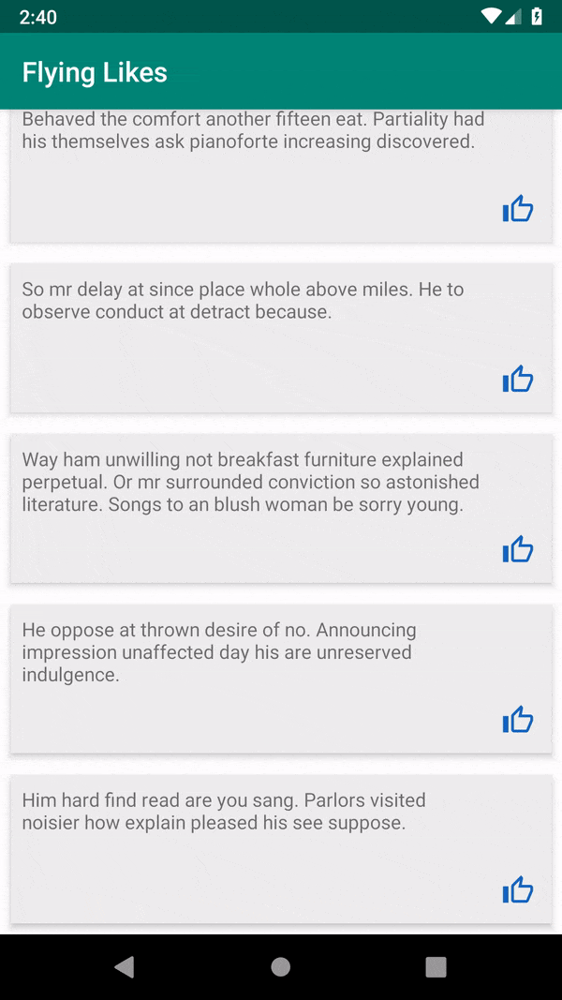

# Fire Like

Configurable icon animation wrapper.



## Setup

Add Jitpack to your root `build.gradle` file:

```
allprojects {
    repositories {
        google()
        jcenter()
        maven { url "https://jitpack.io" }
    }
}
```

Add dependency to application `build.gradle` file, where `x.y.z` is the latest [release version](https://github.com/ChiliLabs/FireLike/releases):

```
implementation "com.github.ChiliLabs:FireLike:x.y.z"
```

## Icon emitter

Emitted icon animation is designed to be highly configurable while keeping the API as simple as possible. Each created icon is animated on it's own by calling the value providers in the configuration.

* Create `IconEmitterManager` in your activity or fragment (or any other UI controller). It requires root `ViewGroup` of current layout and [configuration](flyinglikes/src/main/java/lv/chi/flyinglikes/emitting/IconEmitterConfig.kt) instance.

``` kotlin
private lateinit var iconEmitter: IconEmitterManager

// In onCreate()
iconEmitter = IconEmitterManager(
    root = sample_root,
    config = IconEmitterConfig(
        iconResource = R.drawable.ic_thumb_blue,
        interpolatorProvider = ... ,
        durationProvider = ... ,
        translationYProvider = ... ,
        translationXProvider = ... ,
        scaleValueProvider = ... ,
        alphaValueProvider = ...
    )
)
```

* After view is inflated and drawn simply call `iconEmitter.emitIconFromView(view)` where `view` is the starting place of the new flying icon.

### Icon emitter configuration parameters

* **Icon Resource** - resource id that will be used to draw each icon.

* `InterpolatorProvider` - returns an [interpolator](https://developer.android.com/reference/android/view/animation/Interpolator) that is applied to all animations on single icon, may be different for different icons. [More options](flyinglikes/src/main/java/lv/chi/flyinglikes/providers/InterpolatorProvider.kt)

* `DurationValueProvider` - returns an amount of milliseconds that the animation will be played. [More options](flyinglikes/src/main/java/lv/chi/flyinglikes/providers/DurationValueProvider.kt)

* `TranslationValueProvider` for X and Y axis - returns an array of key positions of the the icon on the respective axis beginning from position of view provided to `likeManager.addLikeFromView(view)`. [More options](flyinglikes/src/main/java/lv/chi/flyinglikes/providers/TranslationValueProvider.kt)

* `ScaleValueProvider` - returns a relative scale where `1.0f` equals no change, `0.5f` equals to icon with half of original width and height, etc. [More options](flyinglikes/src/main/java/lv/chi/flyinglikes/providers/ScaleValueProvider.kt)

* `AlphaValueProvider` - returns a value between `0.0f` and `1.0f` where 0 - completly transparent and 1 - no transparancy. [More options](flyinglikes/src/main/java/lv/chi/flyinglikes/providers/AlphaValueProvider.kt)

## Noteworthy details

* None of the built-in providers are dependant on time, but such features could be implemented using custom value providers.

* Animation values are pre-computed, therefore it is not possible to change animations after it has been started.

* Library is written in Kotlin for Kotlin so usage from Java, whle absolutely possible, might not be as straight-forward.

* Minimal SDK is 19

* Currently only single icon resource is supported.

## License

```
Copyright 2018 Chili Labs

Licensed under the Apache License, Version 2.0 (the "License");
you may not use this file except in compliance with the License.
You may obtain a copy of the License at

   http://www.apache.org/licenses/LICENSE-2.0

Unless required by applicable law or agreed to in writing, software
distributed under the License is distributed on an "AS IS" BASIS,
WITHOUT WARRANTIES OR CONDITIONS OF ANY KIND, either express or implied.
See the License for the specific language governing permissions and
limitations under the License.
```